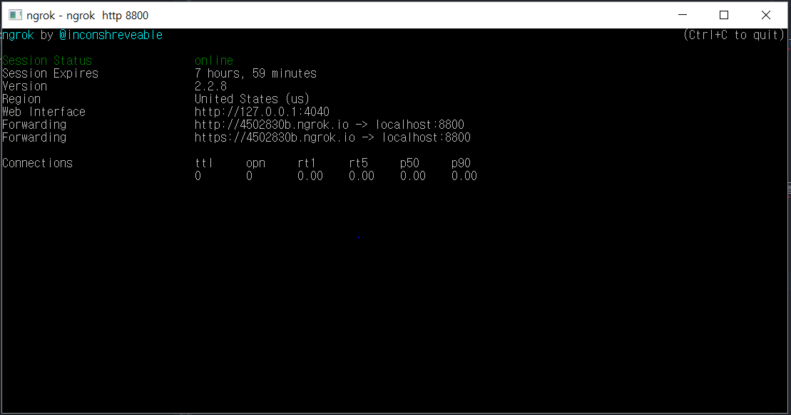
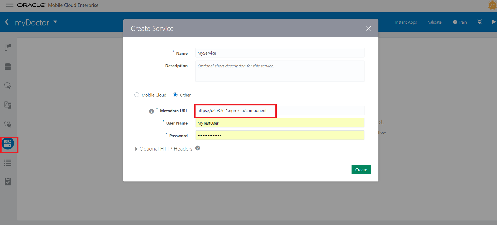
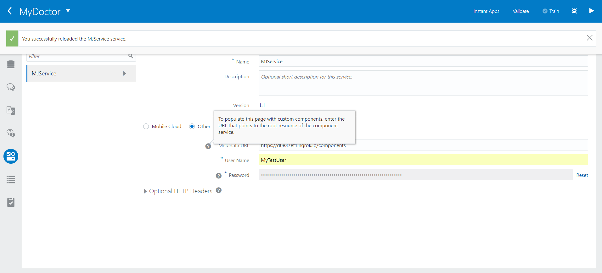
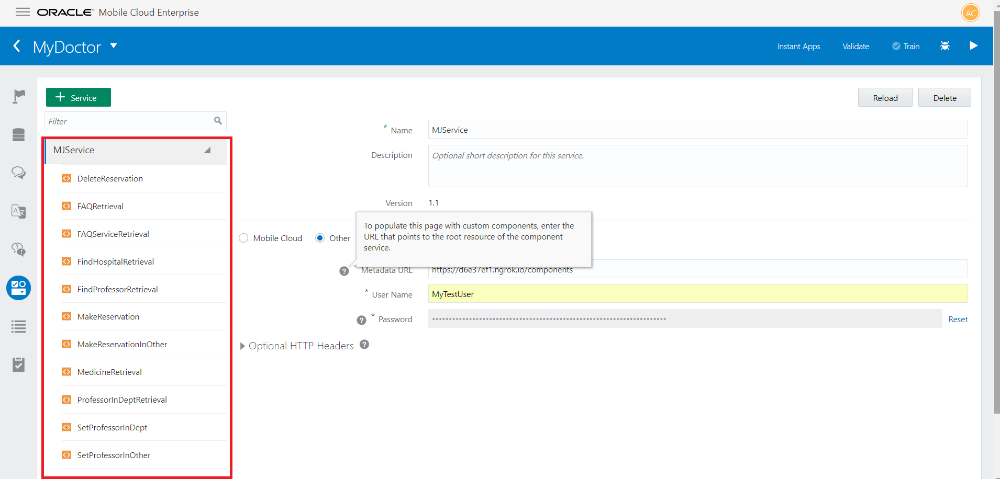

Step 2 - ngrok server 연동
=======

웹사이트나 API 서버 등을 개발할 때 보통은 로컬에 개발환경이 구축되어 있으므로 외부에서 접근하려면 외부에서 접속할 수 있는 서버에 올리거나 해야 합니다.
이때 ngrok을 통해서 로컬 디비서버에 접속하고 연동하여 챗봇의 기능을 확장할 수 있습니다.

### 1. ngrok 실행하기
 ngrok 홈페이지(https://ngrok.com)에 접속하여 *start by downloading ngrok* 으로 파일을 다운 받습니다.
 ngrok.exe를 실행하고 다음을 입력N합니다.

 ~~~
  $ ngrok http 8886
 ~~~

 단, MyDoctor-Chatbot/index.js 의 server.listen의 포트번호와 ngrok에 입력하는 포트번호가 같도록 해야합니다.
 ~~~
 server.listen(process.env.SERVICE_PORT || 8886);
~~~

정상적으로 실행되면 다음과 같은 화면이 나옵니다.


Forwarding의 https로 시작하는 주소를 복사해주세요
ex) https://4502830b.ngrok.io

### 2. ngrok을 챗봇 솔루션 컴포넌트와 연결하기
복사한 주소를 솔루션의 Componets 탭의 Metadata URL 에 넣고 /componets 를 뒤에 넣어주세요.

~~~
Bad gateway 등의 오류가 있을 시
1. index.js의 포트번호와 ngrok의 번호가 일치하는지 확인하고
2. index.js를 실행 한 상태인지 확인합니다.
$ ...\myDoctor\MyDoctor-Chatbot-Componetns> node index.js 를 입력하여 실행할 수 있습니다.
~~~

다음과 같은 메세지가 나오면 로컬의 컴포넌트와 연결이 완료됩니다.


연동이 완료되면 Service와 그와 연결된 컴포넌트들을 확인하실 수 있습니다.


~~~
User Name 과 Password는 담당자에게 문의해주세요
~~~

###Step 3 넘어가기 : [Step 3 - 약학정보 페이지크롤링](https://github.com/minD3D/MyDoctor-Guide/blob/master/crawling2.md)
