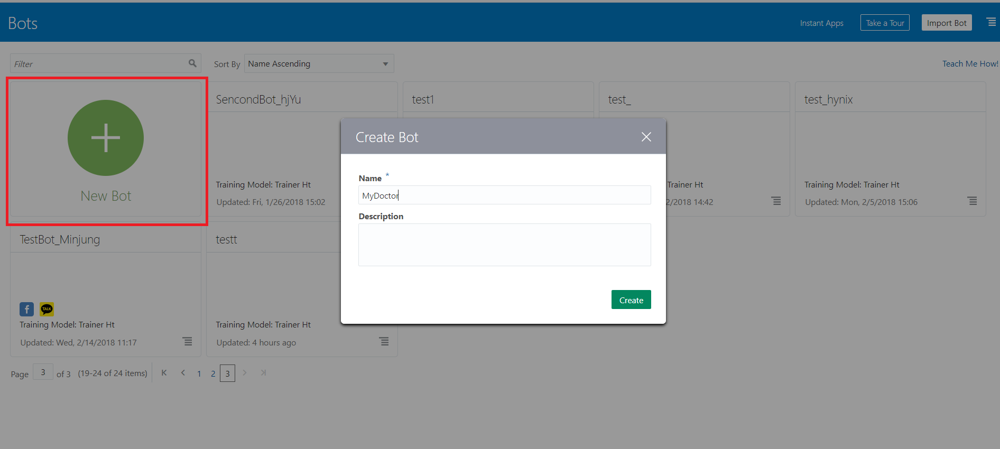
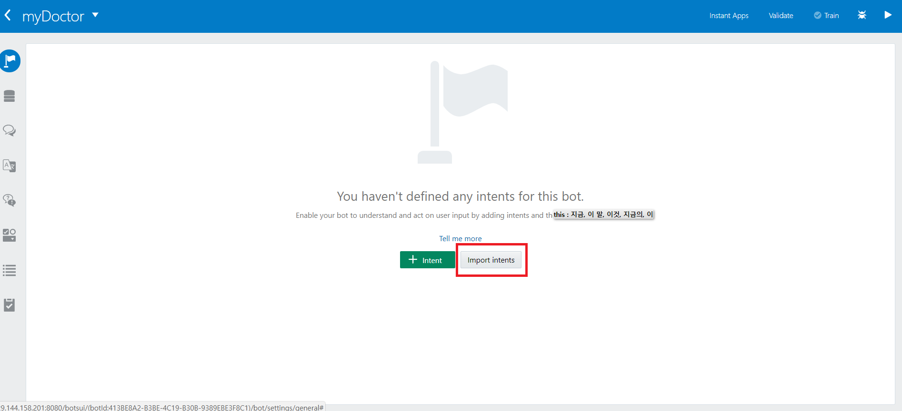
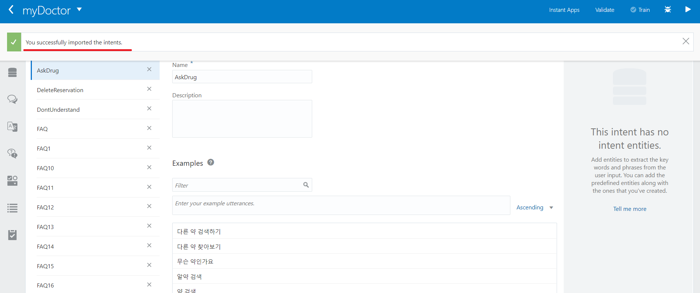
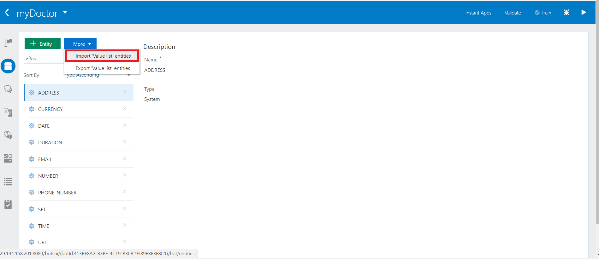
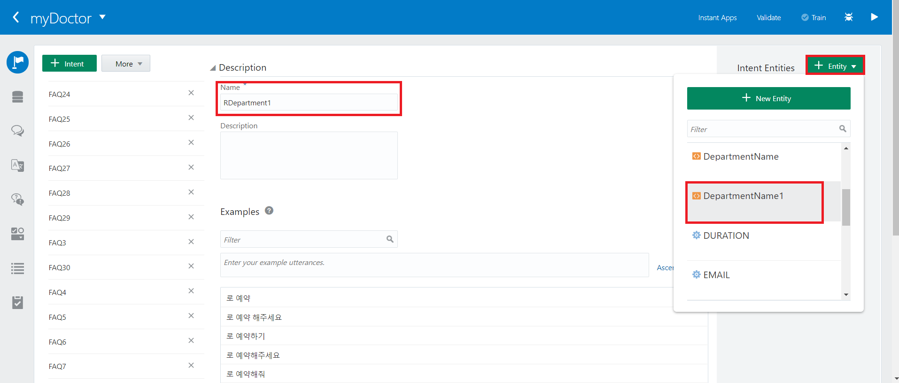
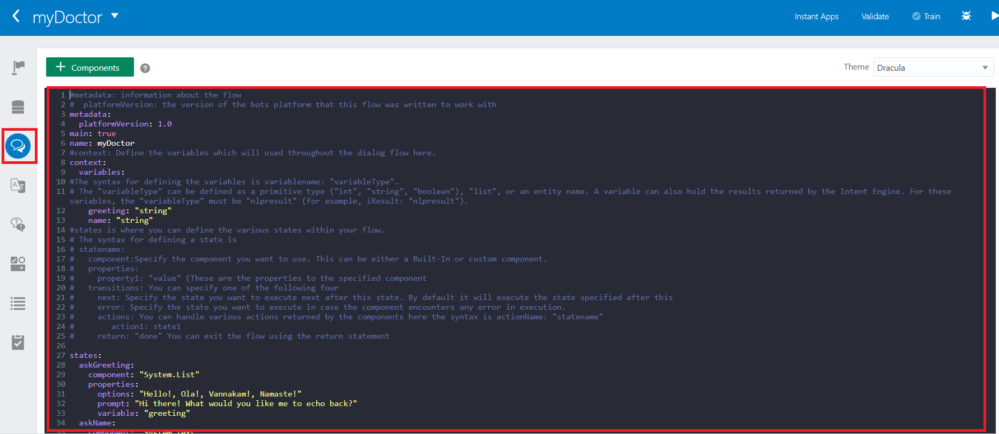

Step 1 - 솔루션 빌드
=======

챗봇 솔루션을 만들고 커스텀 컴포넌트를 실행하여 연동할 수 있는 환경을 만듭니다.
시작 전에 myDoctor.zip 파일 압축을 풀어
- MyDoctor-Chatbot-Components.zip
- MyDoctor-Entities.csv
- MyDoctor-Intents.csv
- flow.yaml
이 있는지 확인합니다.

### 1. 챗봇 만들기
챗봇 개발 클라우드 환경에서 New Bot 버튼을 눌러 myDoctor 봇을 생성합니다.

### 2. 인텐트 추가하기
Import intents를 눌러 myDoctor/MyDoctor-Intents.csv 파일을 import 해주세요.  


import 가 완료되면 다음과 같은 메세지가 나옵니다.


### 3. 엔티티 추가하기
다음 Entities 탭에서 다음 버튼을 눌러 myDoctor/MyDoctor-entities.csv를 import 해주세요

### 4. 인텐트와 엔티티 연결하기
추가된 entity 는 필요에 따라 intent와 연결해 주어야 합니다.
intent 탭의 RDepartment1 를 선택하고 Entity 중 DepartmentName1 을 추가해 줍니다.
~~~
추가된 entity 는 인텐트 분석시 분류되어 더욱 원활한 분석이 가능합니다.
~~~

### 5. 플로우 추가하기
Flows 탭에서 다음 부분을 모두 지우고 myDoctor/flow.ymal 의 내용을 복사해 넣어주세요

####Step 2 넘어가기 : [Step 2 - ngrok](https://github.com/minD3D/MyDoctor-Guide/blob/master/ngrok.md)
